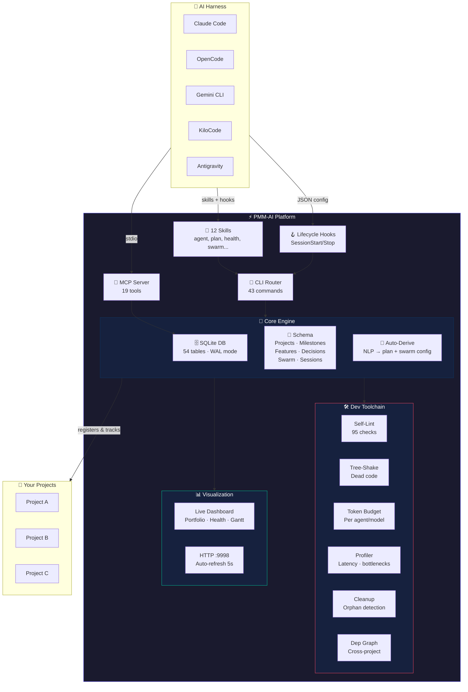
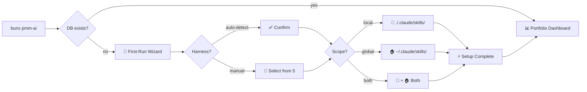
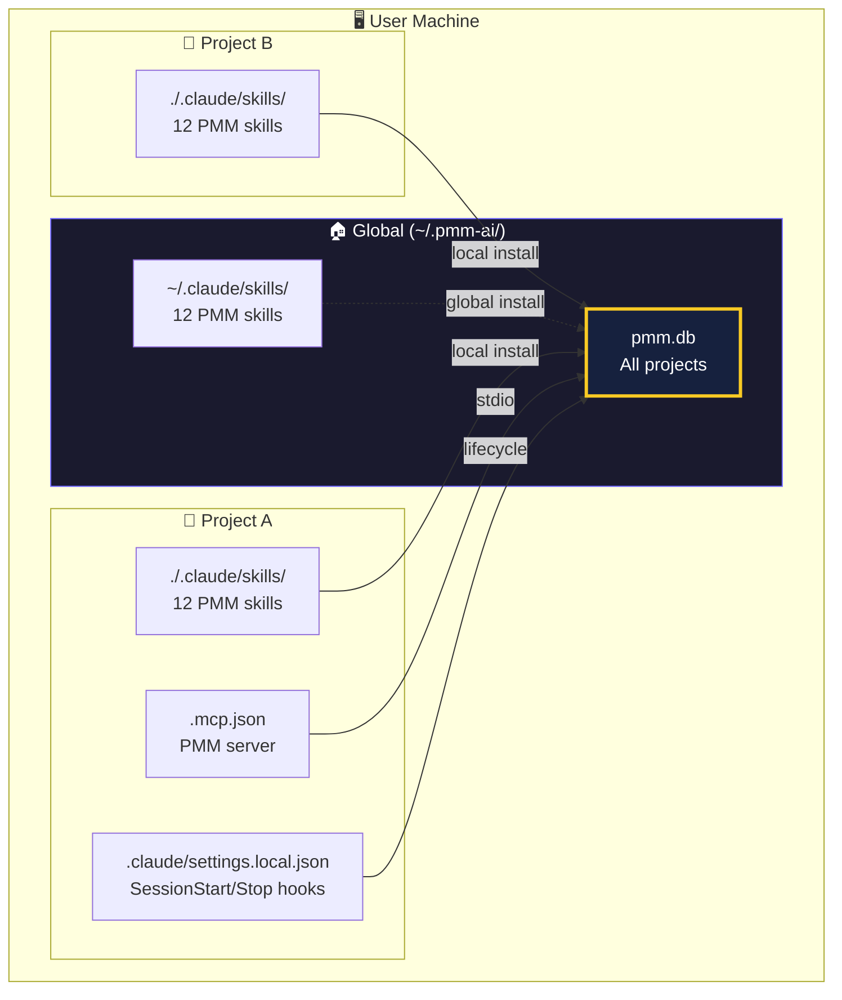
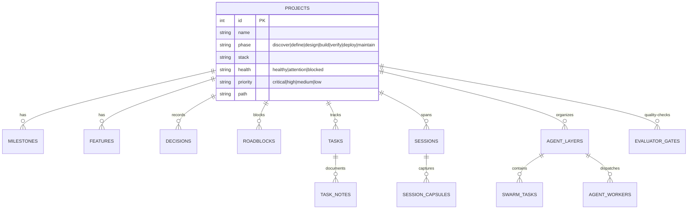
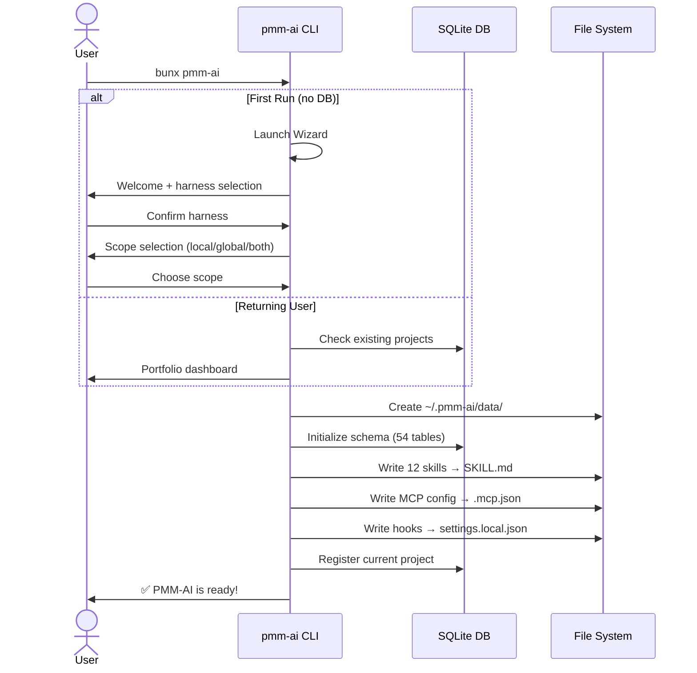
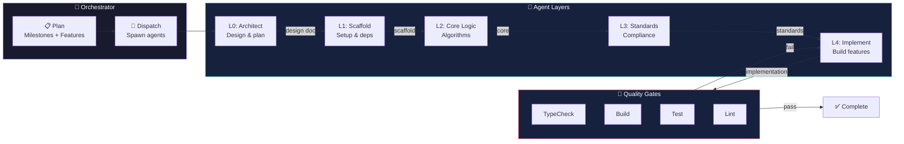

<p align="center">
  
  
  
  
</p>

<h1 align="center">⚡ PMM-AI</h1>
<p align="center"><strong>Autonomous AI Development Platform</strong></p>
<p align="center">One command. Any AI harness. Complete project intelligence.</p>

---

## What is PMM-AI?

PMM-AI is a **harness-agnostic autonomous development platform**. It gives your AI coding agent persistent project memory, multi-agent swarm orchestration, quality evaluation gates, and cross-session continuity — all from a single SQLite database.

### The Problem

AI coding agents forget everything between sessions. They brute-force file searches. They don't know what was planned, decided, or blocked — especially across different tools.

### The Solution

**One command.** PMM-AI auto-detects your harness, registers 12 skills, configures MCP, sets up lifecycle hooks, and gives your agents structured project intelligence.

```
Without PMM:  Search(pattern: "**/*") → expensive, unstructured, no memory
With PMM:     pmm project get <name> → instant, structured, full history
```

---

## System Overview



---

## Quick Start

### Interactive First-Run Wizard

On a fresh machine, just run:

```bash
bunx pmm-ai
```

No DB detected? PMM-AI launches an interactive wizard:

```
╔══════════════════════════════════════════╗
║   Welcome to PMM-AI!                     ║
║   Autonomous Development Platform        ║
╚══════════════════════════════════════════╝

  Let's get you set up. I'll ask a few questions.

  Detected claude-code. Use this? [Y/n]

  Where should PMM-AI skills and hooks be installed?
   > [1] Local only — ./.claude/skills/ (for this project)
     [2] Global only — ~/.claude/skills/ (all projects)
     [3] Both — local + global (recommended)
  Pick [3]

  ═══ Configuration Summary ═══
  Harness:       claude-code
  Install scope: both
  DB location:   ~/.pmm-ai/data/pmm.db

  Proceed with setup? [Y/n]
```



### Setup Flags (Power Users)

```bash
bunx pmm-ai setup               # Interactive (harness selection + scope)
bunx pmm-ai setup --local       # Local only, auto-detect harness
bunx pmm-ai setup --global      # Global only (~/.claude/skills/)
bunx pmm-ai setup --both        # Both local + global
bunx pmm-ai setup --local --no-interactive  # CI/CD friendly
```

### Daily Use

```bash
bunx pmm-ai                    # Portfolio dashboard + live server
bunx pmm-ai start new          # "What are you building?" → auto-plan → swarm config
bunx pmm-ai health             # Portfolio health check
bunx pmm-ai tooling all        # Full platform scan (6 dev tools)
```

---

## Architecture

### Deployment Topology



### Data Model (Core Tables)



### Setup Process Flow



### Agent Swarm Execution



---

## Features

### 🧠 Persistent Project Memory
Every session captured. Every decision recorded. Every plan structured. Your agent picks up where it left off — even across different harnesses.

- **Projects**: phase, stack, health, priority, repo path
- **Milestones**: deadline-bound deliverables with acceptance criteria
- **Features**: user-facing capabilities with priorities
- **Decisions**: architectural choices with rationale (ADR-style)
- **Roadblocks**: blockers with severity and resolution tracking
- **Tasks**: atomic work units with notes, methods, evidence, session linking

### 🚀 Multi-Agent Swarm Orchestration
Auto-configured agent layers with RACI roles, parallel tracks, checkin/checkout task pools, and escalation paths. Describe your app → PMM-AI generates the plan and deploys the swarm.

### 🌐 Harness-Agnostic

| Harness | Detected By | Skills | MCP | Hooks |
|---------|------------|--------|-----|-------|
| Claude Code | `.claude/settings.local.json` | 12 skills | 19 tools | SessionStart/Stop |
| OpenCode | `.opencode/` | 12 skills | 19 tools | SessionStart/Stop |
| Gemini CLI | `.gemini/` | 12 skills | 19 tools | SessionStart/Stop |
| KiloCode | `.kilocode/` | 12 skills | 19 tools | SessionStart/Stop |
| Antigravity | `.antigravity/` | 12 skills | 19 tools | SessionStart/Stop |

### 📊 Live Dashboard
Portfolio overview, project health gauges, swarm progress bars, recent activity feed. Auto-refreshes at `http://localhost:9998`. No build step. Single HTML file per project.

### 🔍 Built-In Dev Toolchain
Traditional dev tools, reimagined for AI-assisted development:

| Traditional Tool | PMM-AI Equivalent | Command |
|-----------------|-------------------|---------|
| Tree Shaking | Dead Module Detector | `pmm-ai tooling tree-shake` |
| ESLint | Self-Audit Linter (95 checks) | `pmm-ai tooling lint` |
| Bundle Analyzer | Token Budget Tracker | `pmm-ai tooling tokens` |
| Clinic/Profiler | Agent Performance Tracker | `pmm-ai tooling profile` |
| GC/Leak Detector | Orphan Cleanup | `pmm-ai tooling cleanup` |
| Linker/ld | Cross-Project Dep Graph | `pmm-ai tooling deps` |

### 🎯 Quality Gates
Programmable evaluator gates with defined thresholds, watch mode, and agent-as-judge. Auto-run on session end. 4 consolidation health gates pre-configured.

---

## Source Tree

```
PMM-AI/
├── bin/
│   ├── pmm-ai.cjs               ← npm bin shim (Node CJS → bun)
│   └── pmm.ts                   ← setup entry: wizard, harness detect, install
├── scripts/
│   └── cli.ts                   ← 225-line CLI router (43 commands)
├── src/
│   ├── db.ts                    ← SQLite WAL — single-file DB, zero npm deps
│   ├── schema.ts                ← DDL — 54 tables, indexes, migrations
│   ├── auto-derive.ts           ← NLP → project profile + swarm config
│   ├── events.ts                ← Typed pub/sub event bus (in-process)
│   ├── commands/                ← 10 modules: project, planning, swarm, health...
│   ├── tooling/                 ← 6 modules: tree-shake, self-lint, tokens...
│   ├── visualization/           ← Dashboard: data → HTML generator → live server
│   ├── mcp/server.ts            ← MCP stdio server (19 tools)
│   ├── execution/               ← Harness adapters, swarm deployment, planner
│   └── process/                 ← Environment scanner, artifact bridge
├── state/                       ← Self-referential session state
└── package.json                 ← v1.1.0 · zero dependencies
```

**Key design properties:**
- **Zero npm dependencies** — uses only Bun built-ins + Node stdlib
- **Database at `~/.pmm-ai/data/pmm.db`** — survives npm cache clears, shared across projects
- **Harness-agnostic** — MCP protocol works with any AI tool
- **Interactive + scriptable** — wizard for humans, `--no-interactive` for CI/CD
- **Rust-translatable** — every module exports `Record<string, (db, args) => Promise<void>>`

---

## Commands

### MVP (start here!)
```
pmm-ai start [new|<project>]     Portfolio, wizard, project dashboard
pmm-ai view <project>            HTML project dashboard
pmm-ai health [triage]           Portfolio health check
pmm-ai summary                   Quick counts
```

### Projects & Planning
```
pmm-ai project <register|onboard|discover|list|get|update|delete>
pmm-ai milestone <add|list|update|complete>
pmm-ai feature <add|list|update|complete>
pmm-ai roadblock <add|list|resolve>
pmm-ai decision <add|list|decide|review>
pmm-ai task <add|list|update|complete|log>
```

### Agent & Swarm
```
pmm-ai worker <dispatch|update|list|trace|schedule>
pmm-ai swarm <deploy|visualize|status|export>
pmm-ai layer <list|update>
pmm-ai session <register|close|list|get|name>
```

### Tooling
```
pmm-ai tooling <lint|tree-shake|tokens|profile|cleanup|deps|all>
```

### Advanced
```
pmm-ai wizard <project|milestone|decision|swarm>
pmm-ai evaluator <define|run|list|latest>
pmm-ai standards <check|list>
pmm-ai process scan
pmm-ai mem sync
```

---

## MCP Tools (19 total)

Any MCP-compatible harness can call these directly:

### Read (10)
| Tool | Returns |
|------|---------|
| `pmm_context` | AI-ready context: phase, milestones, decisions, next actions |
| `pmm_project_get` | Full project detail: stack, health, planning data |
| `pmm_project_list` | All projects with filters |
| `pmm_milestone_list` | Milestones with status filter |
| `pmm_feature_list` | Features with status filter |
| `pmm_decision_list` | Architectural decisions |
| `pmm_summary` | Portfolio overview |
| `pmm_health_check` | P0/P1 alerts, staleness, blocks |
| `pmm_dependencies` | Cross-project dependency graph |
| `pmm_process_scan` | Methodologies, artifacts, phase, gaps |

### Write (9)
| Tool | When to Call |
|------|-------------|
| `pmm_session_start` | Session start |
| `pmm_session_end` | Session end |
| `pmm_worker_dispatch` | Before spawning a subagent |
| `pmm_worker_update` | Worker lifecycle changes |
| `pmm_milestone_update` | Milestone status change |
| `pmm_feature_update` | Feature status change |
| `pmm_decision_add` | Architectural decision made |
| `pmm_roadblock_add` | Blocker found |
| `pmm_alert_create` | Alert condition |

---

## Requirements

- [Bun](https://bun.sh) >= 1.3.0
- An AI coding harness (Claude Code, OpenCode, Gemini CLI, KiloCode, or Antigravity)

## Install / Uninstall

```bash
# Interactive (recommended)
bunx pmm-ai setup

# Scripted / CI
bunx pmm-ai setup --local --no-interactive
bunx pmm-ai setup --global --no-interactive
bunx pmm-ai setup --both --no-interactive

# Remove
bunx pmm-ai unregister    # Remove skills, MCP, hooks (data preserved)
```

## Contributing

See [CONTRIBUTING.md](CONTRIBUTING.md). PRs welcome. Check `pmm-ai tooling all` for platform health before submitting.

## License

MIT © [VIVIM](https://vivim.live)

---

<p align="center">
  <sub>Built with ❤️ by <a href="https://vivim.live">VIVIM</a></sub><br>
  <sub>Part of the PMM ecosystem — <i>Project Memory that outlives the session</i></sub>
</p>
